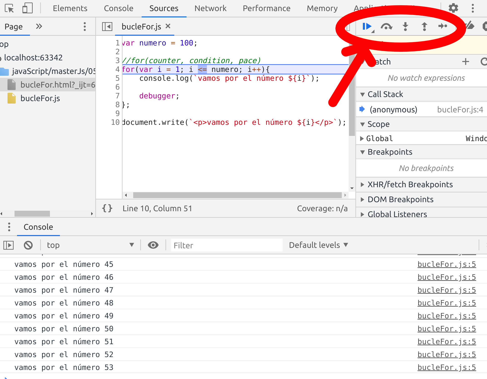

# Bucles
Estructura de control(trozo de código) que se repite un número definido de veces.

## Bucle for

Si quiero mostrar todos los números del 1 al 100 en la pantalla:
```jsx
var numero = 100;

//for(counter, condition, pace)
for(var i = 1; i <= numero; i++){
console.log(i);

debugger
document.write(`<p>vamos por el número ${i}</p>`);

};
```
## Debugger
Poniendo la expresión "debugger" vamos a poder debugear a través del navegador viendo todos que parte del bucle se ejecuta en cada momento:



## Bucle while

Comprueba una condición y luego ejecuta un bloque de código:

```jsx
var year = 2020;

while(year <= 2051){
    //ejecuta esto
    console.log("Estamos en el año " + year);
    year ++;
}
```
Nos devolverá todos los años desde 2020 a 2051

## Bucle do while
Primero ejecuta el bloque de código y luego comprueba la condición para volver a ejecutar ese bloque de código o parar (al revés que en el while).

```jsx
var years = 30;

do{
    console.log(`vamos por el ${years}`);
    alert(`vamos por el ${years}`);
    years --;
} while (years >= 25);

//ejecuta ese alert/console.log hasta que years sea mayor o igual que 25
```

## Break
Corta la ejecución del bulce:
El break dentro de un bucle nos permite salir de la estructura de control y dejr de ejecutar bucle para que no se hagan más iteraciones


```jsx
var years = 30;
do {
    console.log(`vamos por el ${years}`);
    alert(`vamos por el ${years}`);
    if(years == 28){
        break;
    };
    //sólo se va a ejecutar hasta que llegue a 28 por el break que hemos introducido
    years--;
} while (years >= 25);
```
## Bucles con objetos y arrays: ForEach vs .map

* .map() nos evita el uso de bucles y nos devuelve un array nuevo.

* El método map() crea un nuevo array con los resultados de la llamada a la función indicada aplicados a cada uno de sus elementos.

* array.map( x => x*2) me devuelve un nuevo array donde cada elemento "x" del array anterior es multiplicado x 2
```jsx
var cars2 = [
    {brand: "Rover", name: "420 hdi", owner: "Mamá"},
    {brand: "Audi", name: "A4 gasolina atmosférico", owner: "Mamá"},
    {brand: "citröen", name: "BX", owner: "Mamá"},
    {brand: "citröen", name: "Xantia", owner: "Papá"},
    {brand: "Land Rover", name: "Discovery", owner: "Papá"},
    {brand: "Mercedes", name: "serie 5", owner: "Papá"},
]

//conseguir las marcas con forEach():

var cars2Brands =[];
cars2.forEach(function (cars2) {
    cars2Brands.push(cars2.brand)
});

console.log(cars2Brands);

//conseguir el owner con .map()

const cars2Owners = cars2.map(propietario => propietario.owner);

console.log(cars2Owners);

//creando un array de objetos con .map()
cars2ownerBrand = cars2.map(carOwner =>  ({car: carOwner.name, owner: carOwner.owner}));

console.log(cars2ownerBrand);

```