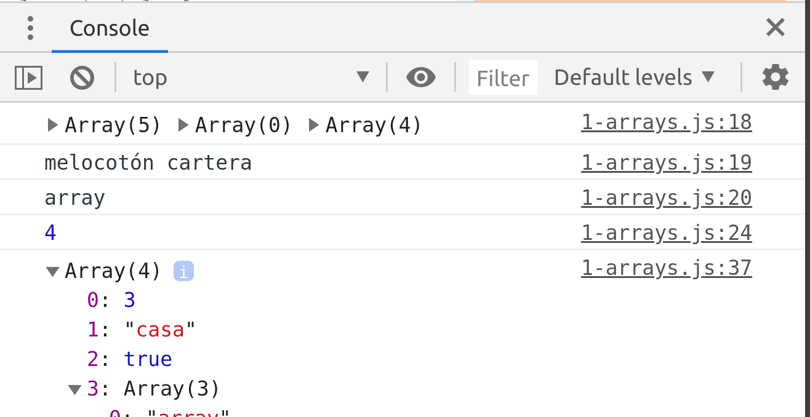

# Arrays

## 1. Conceptos Básicos
* Un array es una colección de datos que puede tener una variable
* También se les conoce como arreglos o matrices


var frutas = ["melocotón", "manzana", "pera", "kiwi", "plátano"];

puedo meter el tipo de datos que yo quiera, incluso otro array

```jsx
var arrayMezclado = [3, "casa", true, ["array","dentro","de array"]];
var arrayVacío = [];
```

Se pueden crear con la clase array:
```jsx
var misCosas = new Array("teléfono","cartera","llaves","reloj");
```
Indices del Array: cada elemento del array tiene un indice empezando por el 0;
```jsx
console.log(frutas, arrayVacío, misCosas); //[ 'melocotón', 'manzana', 'pera', 'kiwi', 'plátano' ] [] [ 'teléfono', 'cartera', 'llaves', 'reloj' ]
console.log(frutas[0],misCosas[1]);//melocotón cartera
console.log(arrayMezclado[3][0]);//array
```
Podemos ver el número de elementos de un array con el método .length
```jsx
console.log(arrayMezclado.length);//4
```
Ejercicio array y ventanas en el DOM:
```jsx
var elementoArray = (parseInt(prompt("¿Qué elemento del array frutas quieres seleccionar?",0)));
while(elementoArray > (frutas.length - 1) || elementoArray < 0){
    alert(`el array frutas tiene ${frutas.length} elementos comprendidos entre las posiciones 0 y ${frutas.length - 1}, debe indicar un número comprendido entre 0 y ${frutas.length - 1}`);
    elementoArray = (parseInt(prompt("¿Qué elemento del array frutas quieres seleccionar?",0)));
}
alert (`el elemento seleccionado es ${frutas[elementoArray]}`);
document.write(`el elemento seleccionado es <strong>${frutas[elementoArray]}</strong>`);
```


recorrer un array completo y mostrar todos sus elementos por pantalla y por consola
```jsx
document.write(`</br><h2>Array con elementos de diferentes tipos</h2></br> [${arrayMezclado}]</br>`)
console.log(arrayMezclado)
```


* Si quiero que me dibuje los elementos uno por uno en la página html lo tengo que hacer con un bucle 
* (este método es poco eficiente, ser recorren mejor con un [forEach](#recorrer-arrays-con-foreach))
```jsx
document.write(`El <strong>arrayMeclado</strong> se compone de los siguientes elementos: </br><ul>`)
for(var i=0; i<=arrayMezclado.length; i++){
    document.write(`<li${arrayMezclado[i]}</li>`)
}
document.write(`</ul>`)
```




## 2. Bucles con arrays: forEach y forIn
### Recorrer arrays con ForEach

* foreach: forma de recorrer los elementos de un array
* La forma de trabajar es introducir una función (normalmente arrow por aligerar código) dentro del for each que nos realizará la instrucción indicada en cada elemento del array
* Los parámetros de la función predefinidos que reconoce el array son (element, index, data), el nombre de estos parámetros lo podemos elegir nosotros 
* array.forEach(function(elementoArray, indice, datosCompletosArray){})

```jsx

var arrayAnimales = ["perro", "gato", "gorrión", "ñu"];
let frutas = ['melocotón', 'manzana', 'pera', 'piña'];
let nums = [4,1,7612312,43,49,5,6];


arrayAnimales.forEach((elemento, indice, array)=>console.log(elemento, indice, array));
//perro 0 [ 'perro', 'gato', 'gorrión', 'ñu' ]
// gato 1 [ 'perro', 'gato', 'gorrión', 'ñu' ]
// gorrión 2 [ 'perro', 'gato', 'gorrión', 'ñu' ]
// ñu 3 [ 'perro', 'gato', 'gorrión', 'ñu' ]
```
No tenemos que pedir siempre los 3 elementos predefinidos de forEach
```jsx
frutas.forEach(fruta => {console.log(fruta);});
nums.forEach(num => { console.log(num);});
arrayAnimales.forEach(animal => { console.log(animal)});
```
Podemos añadir contadores dentro del foreach:
```jsx
frutas.forEach((fruta, i) => { console.log(i,fruta);});
nums.forEach((num, i) => { console.log(i,num);});
arrayAnimales.forEach((animal, i) => {
    let length = `caracteres ${animal.length}`;
    return console.log(i, animal, length)
})
```
En esta función pedimos que nos escriba en el navegador una lista con los elementos del array
```jsx
document.write(`<ul>`);
arrayAnimales.forEach((elemento, i) => {
    document.write(`<li>La posición ${i} del array la ocupa ${elemento}</li>`)
})
```


### Recorrer arrays con forIn

```jsx
'use strict'

let escritorio = ["post-it", "lap-top", "controller", "mouse", "pen", "highlighter", "hydrogel"];

for (let elemento in escritorio){
    console.log(elemento);
}
// 0
// 1
// 2
// 3
// 4
// 5
// 6
for (let elemento in escritorio){
    console.log(escritorio[elemento]);
}
// post-it
// lap-top
// controller
// mouse
// pen
// highlighter
// hydrogel

```

## 3. Arrays multi-dimensionales

* Son arrays dentro de otros arrays

```jsx
let categorias = ['Acción','Terror','Drama'];
var peliculas = ['Terminator','Poltergeist','La vida es bella'];

//Creamos el array multidimensional cine
var cine = [peliculas, categorias]

//Esta es la forma de acceder a los elementos de array multidimensional:
console.log(cine[0][0], "-", cine[1][0]);//Terminator - Acción
console.log(cine[0][1], "-",cine[1][1]);//Poltergeist - Terror
console.log(cine[0][2], "-",cine[1][2]);//La vida es bella - Drama
```
## 4. Operaciones y métodos con arrays
```jsx
'use strict'

let escritorio = ["post-it", "lap-top", "controller", "mouse", "pen", "highlighter", "hydrogel"];
console.log(escritorio);

//Añadir elemento al final
escritorio.push("printer")
console.log(escritorio);
// [ 'post-it',
//     'lap-top',
//     'controller',
//     'mouse',
//     'pen',
//     'highlighter',
//     'hydrogel',
//     'printer' ]

//Eliminar el último elemento
escritorio.pop();
console.log(escritorio);

//Elimina el primer elemento
escritorio.shift();
console.log(escritorio);

//Deshace el shift introduciendo el nombre del elemento
escritorio.unshift("post-it");
console.log(escritorio);

//Localizar un elemento de un array
console.log(escritorio.indexOf("pen"));

//Eliminar un elemento concreto del array con Splice
//Aquí pido que me elimine 3 elementos desde el elemento 4
escritorio.splice(4,3);
console.log(escritorio);

//Convertir un array a texto con .join()

let escritorioString = escritorio.join(", ")
console.log(escritorioString); //post-it, lap-top, controller, mouse

//Convertir string separado por comas a Array
let escritorioArray = escritorioString.split(", ");
console.log(escritorioArray); //[ 'post-it', 'lap-top', 'controller', 'mouse' ]

//Ordenar array
escritorioArray.sort()
console.log(escritorioArray)//[ 'controller', 'lap-top', 'mouse', 'post-it' ]

//dar la vuelta al array
escritorioArray.reverse()
console.log(escritorioArray)//[ 'post-it', 'mouse', 'lap-top', 'controller' ]
```
## 5. Recorriendo el array con forIn
```jsx
'use strict'

let escritorio = ["post-it", "lap-top", "controller", "mouse", "pen", "highlighter", "hydrogel"];

for (let elemento in escritorio){
    console.log(elemento);
}
// 0
// 1
// 2
// 3
// 4
// 5
// 6
for (let elemento in escritorio){
    console.log(escritorio[elemento]);
}
// post-it
// lap-top
// controller
// mouse
// pen
// highlighter
// hydrogel

```
