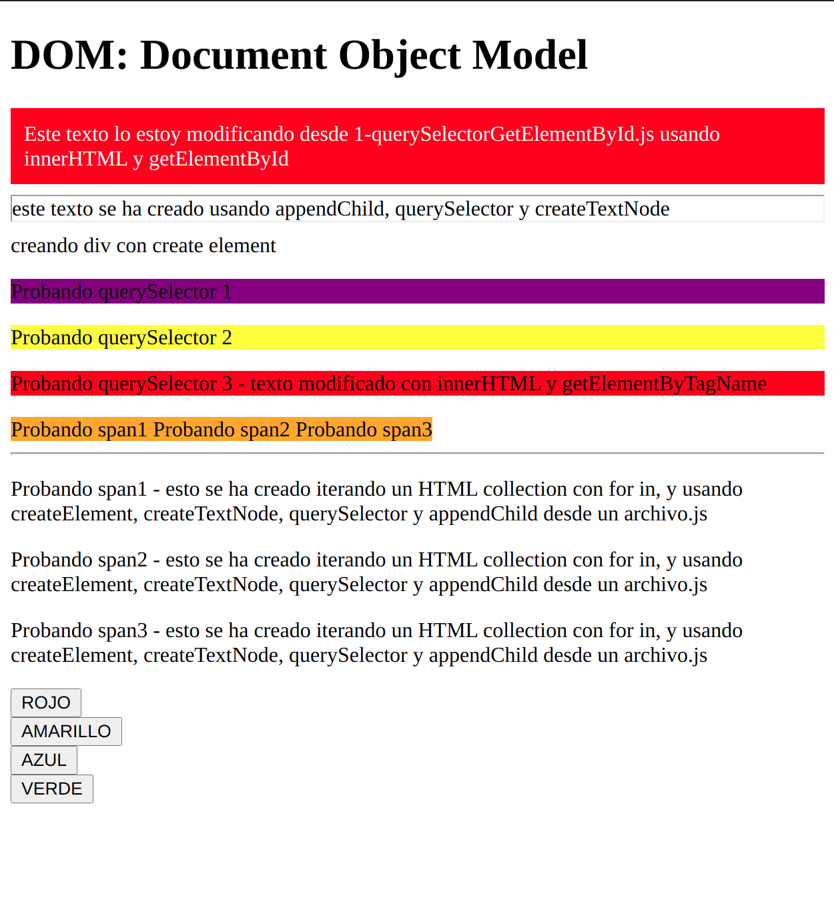

# DOM: Document Object Model

* Son todos los elementos que hay dentro de la página web.
* El árbol de etiquetas y elementos que componen una página web.
* Con JS podemos modificar el HTML de una página
* Podemos seleccionar los diferentes elementos del DOM y manipularlos

Supongamos nuestra página dom.html
```html
<!DOCTYPE html>
<html lang="en">
<head>
    <meta charset="UTF-8">
    <title>DOM</title>
</head>
<body>
<h1>DOM: Document Object Model</h1>

<div id="miCaja"> Hello, soy un div</div>
<section id = "mySection2">
</section>
<p>Probando querySelector 1</p>
<p class="pruebaQuery2">Probando querySelector 2</p>
<p id = "pruebaQuery3">Probando querySelector 3</p>
<span> Probando span1 </span>
<span> Probando span2 </span>
<span> Probando span3 </span>
<section id = "mySection">
    <hr>
</section>


<script src="1-querySelectorGetElementById.js"></script>
</body>
</html>
```

Podemos coger y manipular sus elementos desde el nuestro fichero.js:

### 1. getElementById

```jsx
let modificador = document.getElementById("miCaja");
console.log(modificador);//<div id="miCaja"> Hello, soy un div</div>

//Modificar elementos del DOM
modificador.innerHTML = "Este texto lo estoy modificando desde 1-querySelectorGetElementById.js usando innerHTML y getElementById"

//Modificar estilos
modificador.style.background = "red";
modificador.style.padding = "10px";
modificador.style.color = "white";

// Podemos definir funciones para cambiar color

let cambiaColor = (color) => modificador.style.background = color;

document.write(
    "<button onclick=cambiaColor('red')>ROJO</button></br>" +
    "<button onclick=cambiaColor('yellow')>AMARILLO</button></br>" +
    "<button onclick=cambiaColor('blue')>AZUL</button></br>" +
    "<button onclick=cambiaColor('green')>VERDE</button></br>");

//Podemos añadir atributos HTML

modificador.className = "claseMetidaConJS"
console.log(modificador)

//Si hacemos console.log de nuestro modificador veremos todos los cambios introducidos en el HTML:
/*
<div id="miCaja" class="claseMetidaConJS" style="background: red; padding: 10px; color: white;">
Este texto lo estoy modificando desde 1-querySelectorGetElementById.js usando innerHTML y getElementById</div>
*/
```
### 2. querySelector:
```jsx
let modificadorQuery1 = document.querySelector("p");//Para coger etiquetas html
let modificadorQuery2 = document.querySelector(".pruebaQuery2");//Para coger clases
let modificadorQuery3 = document.querySelector("#pruebaQuery");//Para coger id

modificadorQuery1.style.background="purple";
modificadorQuery2.style.background="yellow";
modificadorQuery3.style.background="red";
```
### 3. getElementByTagName: Conseguir todos los elementos por su etiqueta
```jsx
let sacarP = document.getElementsByTagName('p')
console.log(sacarP)
/*
HTMLCollection(3)
0: p
1: p.pruebaQuery2
2: p#pruebaQuery3
length: 3
*/
//Puedo sacar un p concreto del HTMLCollection y su contenido
console.log(sacarP[0]); //<p style="background: purple;">Probando querySelector 1</p>
console.log(sacarP[2]); //<p id="pruebaQuery3" style="background: red;">Probando querySelector 3</p>
console.log(sacarP[2].textContent);//Probando querySelector 3
sacarP[2].innerHTML = "Probando querySelector 3 - texto modificado con innerHTML y getElementByTagName"

//Con getElementByTagName podemos obtener un HTML collection (objeto con los componentes de las etiquetas HTML que seleccionemos)
let sacarSpan = document.getElementsByTagName('span');
console.log(sacarSpan);//[span, span, span]
console.log(sacarSpan[0].innerHTML);// Probando span1

//Podemos iterar este objeto que hemos sacado con getElementByTagName con for in (forEach es solo para arrays)

for (let index in sacarSpan) {
    console.log(sacarSpan[index])
}
/*
<span> Probando span1 </span>
<span> Probando span2 </span>
<span> Probando span3 </span>
 */

for (let valor in sacarSpan) {
    if (typeof sacarSpan[valor].textContent == 'string') {//filtro para que solo me pase los valores que son texto del objeto
        let textoInformativo = "- esto se ha creado iterando un HTML collection con for in, y usando createElement, createTextNode, querySelector y appendChild desde un archivo.js"
        let parrafo = document.createElement("p");//me crea etiquetas <p>
        let texto = document.createTextNode(sacarSpan[valor].textContent + textoInformativo);//me saca el texto dentro de mis span
        parrafo.appendChild(texto);//metiendo el texto dentro de los parrafos
        document.querySelector("#mySection").appendChild(parrafo)//dónde tiene que introducir parrafo dentro del html
    }
};
```
### 4. getElementByClassName - Conseguir todos los elementos por su clase

```jsx
let sacarClaseMetidaConJS = document.getElementsByClassName("claseMetidaConJS");
console.log(sacarClaseMetidaConJS);

/*
HTMLCollection [div#miCaja.claseMetidaConJS, miCaja: div#miCaja.claseMetidaConJS]
0: div#miCaja.claseMetidaConJS
length: 1
miCaja: div#miCaja.claseMetidaConJS
 */
```
### 5 Crear elementos HTML en el DOM desde archivo.js

#### 5.1 appendChild: dice dónde meto el código
Con appendChild puedo introducir código (etiquetas html, texto, imágenes, etc.) en una parte del html que le indique, o dentro de una etiqueta html que le indique:

[Documento HTML asociado](../14-BOM/bom.html)
```jsx 
let width = screen.width;
let height = screen.height;

document.querySelector("#div1").appendChild(document.createTextNode(width.toString()));
document.querySelector("#div1").appendChild(document.createTextNode(height.toString()));
```
Podemos ordenar este código para facilitar su comprensión:
```jsx 
let where = document.querySelector("#div1");
let what = document.createTextNode(`la altura de la ventana es ${height} y  su ancho es ${width}.`);

where.appendChild(what);
```
Si quisiéramos meter el texto dentro de un nuevo elemento html estos serían los pasos:

```jsx 
//1 dónde
let miDiv =document.querySelector("#div1");
//2 elementoHTML que quiero crear para meter el contenido
let div = document.createElement("div");
//3 contenido
let content = document.createTextNode(width.toString());
//4 meto el contenido dentro del elemento HTML - ElementoHTML.appendChild(contenido)
div.appendChild(content);
//5 invoco al elemento en la sección - dónde.appendChild(elementoHTML)
miDiv.appendChild(div);
```


#### 5.2. createElement y createTextNode
Ya hemos visto su funcionamiento en [5.1 appendChild](# 5.1-appendChild:-dice-dónde-meto-el-código).
Sirven para crear elementos html y nodos de texto respectivamente.

A continuación creamos una función para sacar un elemento html y seguimos trabajando con [dom.html](dom.html).

```jsx
let createHtml = (element, where, text) => {
    let mySection = document.querySelector(where); // donde quiero crear los elementos
    let hr = document.createElement(element);// el elemento que quiero crear
    let texto = document.createTextNode(text);//creo un texto personalizado
    hr.appendChild(texto);//Meto el texto dentro del hr
    mySection.appendChild(hr);//invoco al elemento en la sección con appendChild
};

createHtml("hr","#mySection2","este texto se ha creado usando appendChild, querySelector y createTextNode");
createHtml("div","#mySection2", "creando div con create element");
```
Aquí vemos como creamos un botón que cambia de página.(Ampliar info en [BOM](../14-BOM/bom.md))

```jsx
let redirect = () => window.location.href = "https://es.wikipedia.org/wiki/Jerez_de_la_Frontera";

//Para usar redirect lo voy a meter dentro de un botón que creo a continuación:
let paradiseBtn = document.createElement(`button`);

//Texto del botón
paradiseBtn.innerHTML = "llévame al paraiso";

//Onclick del botón
paradiseBtn.onclick = redirect;

//Creo el <p> que contiene al botón
let pElement2 = document.createElement("p");

pElement2.appendChild(paradiseBtn);
where.appendChild(pElement2);
```

### 6 querySelectorAll()

Saca todos los elementos que con la etiqueta, clase o id que le pidamos:
```jsx
let sacarDivConQuerySelectorAll = document.querySelectorAll("div");
console.log(sacarDivConQuerySelectorAll);
/*
0: div#miCaja.claseMetidaConJS
1: div
length: 2
__proto__: NodeList
 */
```
### Ejemplo cambiar todos los span a color naranja
```jsx

let changeColor = (color,element) => {
    let elem = document.querySelectorAll(element);
    let index = 0, length =elem.length;
    for (0 ;index < length; index ++) {
        elem[index].style.background = color;
    }
};

changeColor("orange","span");

```
Nuestro archivo HTML quedaría de la siguiente forma:


