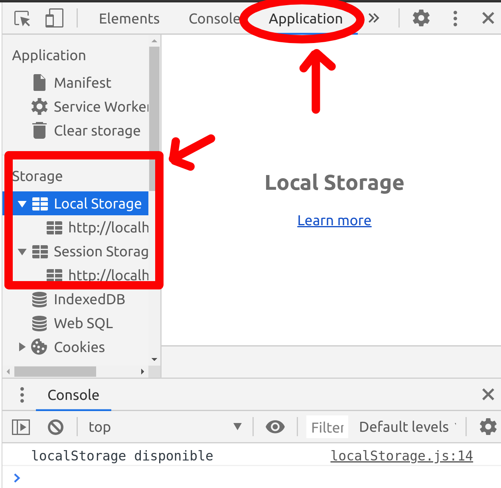
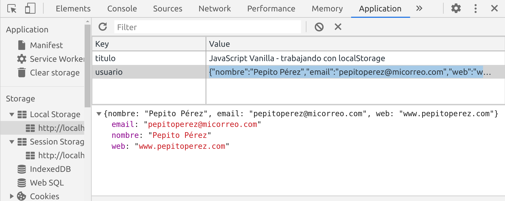
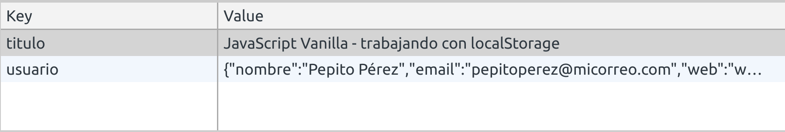
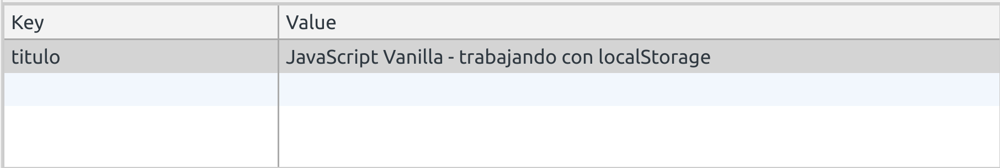
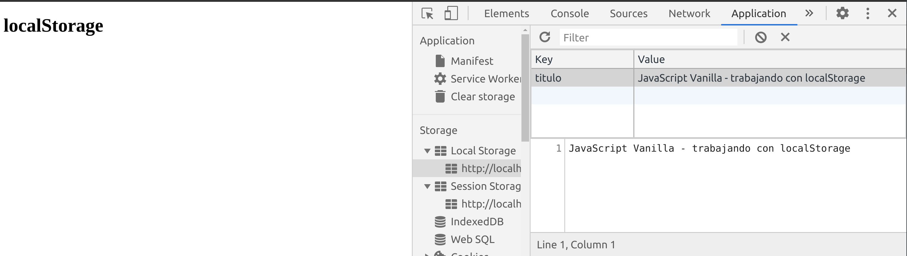

# localStorage/HTML5 Storage

* Es una manera de almacenar información dentro del navegador y que permanezca mientras estoy navegando.
* Es una especie de sesión.
* Muy usado con spa MEAN Stack (MongoDB, ExpressJS, AngularJS, NodeJS).
* En PHP se usan las sesiones.

Suponemos el siguiente archivo.html con el que vamos a trabajar:

```html
<!DOCTYPE html>
<html lang="en">
<head>
    <meta charset="UTF-8">
    <title>LocalStorage</title>
</head>
<body>
<h1>localStorage</h1>
<div id="datos"></div>
<script src="localStorage.js"></script>
</body>
</html>
```

## 1. Comprobamos si localStorage está disponible

```jsx
if(typeof(Storage) !== 'undefined'){
    console.log("localStorage disponible")
} else {
    console.log("Navegador incompatible con localStorage")
};
```

## 2. setItem y getItem: guardar y usar datos.
```jsx
localStorage.setItem("titulo","JavaScript Vanilla - trabajando con localStorage");

let titulo = localStorage.getItem("titulo");
console.log(titulo);//JavaScript Vanilla - trabajando con localStorage
//Si queremos añadirlo a la pantalla del navegador
document.querySelector("body").innerHTML += `<h2>${titulo}</h2>`;
```
Dentro del navegador podemos comprobar nuestro localStorage:

## 3. Guardar objetos - JSON.stringify()

Es necesario pasar los objetos a formato string para poder almacenarlos en localStorage para no perder información

```jsx
//Suponemos el siguiente objeto JSON
let usuario = {
    nombre: "Pepito Pérez",
    email: "pepitoperez@micorreo.com",
    web: "www.pepitoperez.com"
};

//localStorage.setItem("usuario", usuario) -> así no me vale para almacenarlo, tengo que pasarlo a string

let usuarioString = localStorage.setItem("usuario", JSON.stringify(usuario));
console.log(usuarioString);//undefined --> aunque en consola sale undefined en application/local Storage se representa correctamente:
```

## 3. JSON.parse("string"): pasar de string a JSON

Para poder usar esos datos en formato string podemos hacer el proceso inverso:
```jsx
let usuarioJS = JSON.parse(localStorage.getItem("usuario"));
console.log(usuarioJS);//{nombre: "Pepito Pérez", email: "pepitoperez@micorreo.com", web: "www.pepitoperez.com"}

//Ya puedo añadir elementos de mi local storage a la mi web:
document.querySelector("#datos").append(`La página web de ${usuarioJS.nombre} es ${usuarioJS.web}`);
```

## 4. Eliminar datos de localStorage: localStorage.removeItem y localStorage.clear()
Si miramos nuestro localStorage este es su estado:


Aplicamos removeItem, que elimina un item específico.
```jsx
localStorage.removeItem("usuario");//elimina un item específico
```


Aplicamos clear, que vacía todo el localStorage.
```jsx
localStorage.clear(); //vacía el localStorage por completo.
```


Con esta información ya podemos hacer un CRUD (create, read, update, delete), incluso guardar información relacionada con los eventos en el localStorage.

