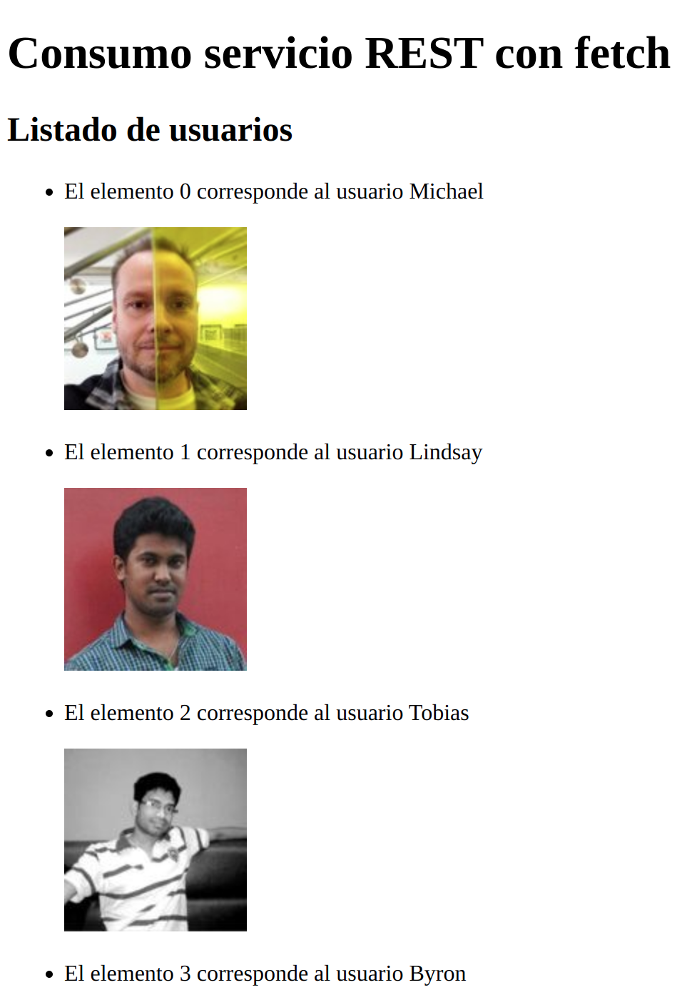

# Peticiones Asíncronas - fetch, promesas, captura de errores

## 1. Fetch (ajax) y peticiones a servicios / apis REST


**<u>FETCH</u>**:
* Es una manera de hacer peticiones a un backend.
* Es una novedad de JavaScript que permite hacer peticiones AJAX de forma más sencilla.
* Petición AJAX: llamada a un servicio REST (API o Backend) con el que vamos a obtener datos.
* (REST representational state transfer - get post put delete - desarrolladores no necesitan descargarse librerías ni software adicional para poder aprovechar del diseño de una API REST - Application Programming Interface).

* Vamos a utilizar [reqres.in](https://reqres.in/) para probar fetch
  * Es un backend que nos devuelve peticiones en JSON


Hacemos una petición de los usuarios a reqres.in
* Fetch es una promesa, se queda a la espera de que pase algo
* then(callback) es un método de Fetch. cuando se cumple la promesa, <u>**entonces**</u> hacemos el callback que meto dentro de .then()


Supongamos que me quiero traer un listado de usuarios de [reqres.in](https://reqres.in/):
```jsx
let ulUsuarios = document.querySelector("#usuarios");//elijo donde voy ubicar la lista de usuarios
ulUsuarios.innerHTML = '<span id="cargando">CARGANDO...</span>';//voy a mostrar este mensaje hasta que se cargue la información
let usuariosData = []; //creo un array en el que voy a meter los datos de usuarios posteriormente

fetch('https://reqres.in/api/users?page=2')//Hacemos la petición para traernos los datos que queremos
    .then(response => response.json())//cuando se cumple la promesa los datos que recibo y que llamo response los paso a formato JSON
    .then(users => { // recojo los datos pasados a json en users y trabajo con ellos
        console.log(users)//compruebo que me sale un objeto del que solo me interesa data
        usuariosData = users.data;//Meto en mi array usuarios users.data (data porque así se llama en la api)
        console.log(usuariosData);//Compruebo que en usuariosData que recogido con el fetch los datos que quería

        //Ahora me dispongo a iterar el array usuariosData .map(), por cada elemento del array ejecutará la función que le pase dentro del map
        usuariosData.map((usuario,i) => {
            let liNombreMasFoto = document.createElement('li');//Por cada elemento voy a crear una etiqueta li
            ulUsuarios.appendChild(liNombreMasFoto)
            liNombreMasFoto.innerHTML = `El elemento ${i} corresponde al usuario ${usuario.first_name} <p></p>`;
            document.querySelector("#cargando").style.display = 'none';//dejo de mostrar el mensaje de cargando con esta linea de código
        })
    });
 ```

Como resultado proyecto en mi HTML los datos de la API que me han interesado:



Hay más ejemplos en los que trabajo con APIS en el directorio [JugandoConAPIS](jugandoConApis)


## 2. Promesas y Fetch

* Las promesas son muy útiles para evitar el *"callback hell"* (un callback dentro de otro callback, dentro de otro callback...).
* Útiles para trabajar con datos asíncronos: peticiones AJAX a API REST
* Puede pasar que tengamos varias peticiones AJAX que tenemos que esperar a que se ejecute una para poder ejecutar otra, para lo que son muy utiles las promesas.

Vamos a suponer que a parte de la promesa anterior, vamos a necesitar sacar los datos de un usuario concreto con otra función. Modificamos todo código anterior para extrapolar funciones y añadimos prompt para indicar el número de página y de usuario que queremos sacar:


```jsx
let ulUsuarios = document.querySelector("#usuarios");
let usuariosData = [];//creo un array

ulUsuarios.innerHTML = '<span id="cargando">CARGANDO...</span>';//voy a mostrar este mensaje hasta que se cargue la información
let page = prompt('introduce el número de página (1 o 2)');

getUsuarios(page)//Esta función hace la petición para traernos los datos que queremos
    .then(response => response.json())//cuando se cumple la promesa los datos que recibo y que llamo response los paso a formato JSON
    .then(users => { // recojo los datos pasados a json en users y trabajo con ellos
        console.log(users)//compruebo que me sale un objeto del que solo me interesa data
        usuariosData = users.data;//Meto en mi array usuarios users.data (data porque así se llama en la api)
        console.log(usuariosData);//Compruebo que en usuariosData que recogido con el fetch los datos que quería
        usersList(users.data);//Con esta función voy a a iterar el array usuariosData con .map()
        let userId = prompt('introduce el número de usuario (del 1 al 12)');
        return getUsuario(userId);
    })
    .then(data => data.json())
    .then(user => {
        mostrarUsuario(user.data)
    });

function getUsuarios(page) {
    return fetch(`https://reqres.in/api/users?page=${page}`)//Hacemos la petición para traernos los datos de los usuarios
};

function getUsuario(userId) {
    return fetch(`https://reqres.in/api/users/${userId}`)
}

function usersList(users) {
    //por cada elemento del array ejecutará la función que le pase dentro del map
    usuariosData.map((usuario, i) => {
        let liNombreMasFoto = document.createElement('li');//Por cada elemento voy a crear una etiqueta li
        ulUsuarios.appendChild(liNombreMasFoto)
        liNombreMasFoto.innerHTML = `El elemento ${i} corresponde al usuario ${usuario.first_name} <p></p>`;
        document.querySelector("#cargando").style.display = 'none';//dejo de mostrar el mensaje de cargando con esta linea de código
    })
};

function mostrarUsuario(usuario) {
    //por cada elemento del array ejecutará la función que le pase dentro del map
    let divUsuarioConcreto = document.querySelector("#usuarioConcreto");
    divUsuarioConcreto.innerHTML = ` usuario ${usuario.first_name} <p></p>`;
    document.querySelector("#cargando").style.display = 'none';//dejo de mostrar el mensaje de cargando con esta linea de código
};
```

## 3. ¿Cómo crear promesas?

Así creamos una promesa para incorporar a nuestra lista de promesas y evitar el callback hell:

```jsx
new Promise((resolve, reject) => {
    if(condition){return reject()};
    return resolve()
};
```

En nuestro caso lo incorporamos dentro de una función
```jsx
function getInfo(){

    let profesor = {
        nombre: "Rosendo",
        apellidos: "Chas",
        url: "https://pro.upgrade-hub.com/"
    };
    //Así creamos una promesa para incorporar a nuestra lista de promesas y evitar el callback hell
    return new Promise((resolve, reject) => {
        let profesorString = "";
        setTimeout(function (){
            profesorString = JSON.stringify(profesor);
            if(typeof (profesorString) != "string" || profesorString == "") return reject('error');
            //No ponemos else porque si se ejectua un return la función no sigue funcionando
            return resolve(profesorString)

        }, 3*1000);
    });
}
```
Y añadimos la promesa dentro de la función a nuestra lista de promesas haciendo algunas modificaciones para que todo se ejecute en el orden que yo quiero
```jsx
getUsuarios(page)//Esta función hace la petición para traernos los datos que queremos
    .then(response => response.json())//cuando se cumple la promesa los datos que recibo y que llamo response los paso a formato JSON
    .then(users => { // recojo los datos pasados a json en users y trabajo con ellos
        console.log(users)//compruebo que me sale un objeto del que solo me interesa data
        usuariosData = users.data;//Meto en mi array usuarios users.data (data porque así se llama en la api)
        console.log(usuariosData);//Compruebo que en usuariosData que recogido con el fetch los datos que quería
        usersList(users.data);//Con esta función voy a a iterar el array usuariosData con .map()
        return getInfo();
    })
    .then(data => { //data es el return del getInfo
        divProfesor.innerHTML = data;
        console.log(data);
        let userId = prompt('introduce el número de usuario (del 1 al 12)');
        return getUsuario(userId);
    })
    .then(data => data.json())
    .then(user => {
        mostrarUsuario(user.data);
    });
```
## 4. Capturar errores en las promesas con .Catch()

Puedo capturar el error y mostrarlo, almacenarlo, etc...

En mi caso añado el método catch después de mi listado de promesas .then():
Puedo probar errores introduciendo un número de profesor > 12
```jsx
.catch(error => { // con el método catch capturo los errores
        alert(error + " He capturado el error con .catch()")
    });
```
## 5. Capturar errores - Try Catch

Si capturo los errores de código puedo seguir ejecutando el resto del código y crear comportamientos predefinidos frente a mis errores.

* try {código que puede dar fallo} catch {comportamiento deseado ante el fallo}
```jsx
try{
    let year = 2019
    alert(yea);// Error: alert is not defined
}catch (error){
    console.log('ha ocurrido un error en el código');
}
let mensaje = "mi código se sigue ejecutando cuando se captura el error"
console.log(mensaje)
// ha ocurrido un error en el código
// mi código se sigue ejecutando cuando se captura el error
```
Si no hubiera capturado el error me daría el siguiente mensaje y no se seguiría ejecutando código:
```jsx
/*
ReferenceError: alert is not defined
    at Object.<anonymous> (/home/angel/github/javaScript/18-PeticionesAsíncronasCapturaErrores/tryCatch.js:2:1)
    at Module._compile (internal/modules/cjs/loader.js:778:30)
    at Object.Module._extensions..js (internal/modules/cjs/loader.js:789:10)
    at Module.load (internal/modules/cjs/loader.js:653:32)
    at tryModuleLoad (internal/modules/cjs/loader.js:593:12)
    at Function.Module._load (internal/modules/cjs/loader.js:585:3)
    at Function.Module.runMain (internal/modules/cjs/loader.js:831:12)
    at startup (internal/bootstrap/node.js:283:19)
    at bootstrapNodeJSCore (internal/bootstrap/node.js:623:3)
 */
```

Si quiero dar una descripción de error, simplemente puedo hacer console.log(error)