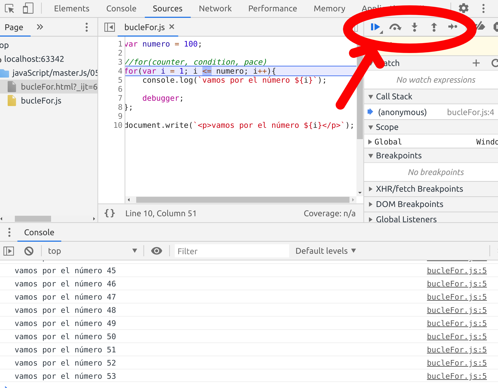

#Bucles
Estructura de control(trozo de código) que se repite un número definido de veces.

##Bucle for

Si quiero mostrar todos los números del 1 al 100 en la pantalla:
```jsx
var numero = 100;

//for(counter, condition, pace)
for(var i = 1; i <= numero; i++){
console.log(i);

debugger
};
```
Poniendo la expresión "debugger" vamos a poder debugear a través del navegador viendo todos que parte del bucle se ejecuta en cada momento:

